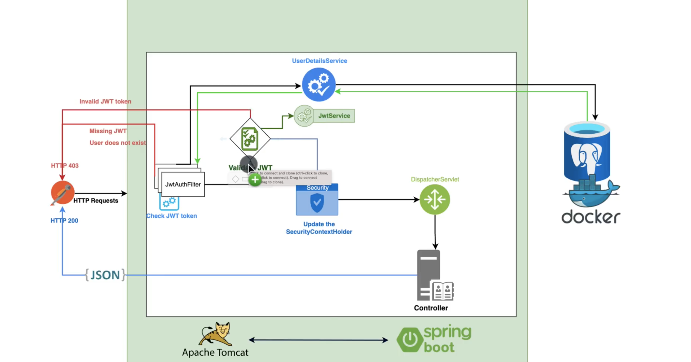

# Security Demo

A small Spring Boot project for learning and practicing **Spring Security** with **JWT authentication**.



## Goal

This project demonstrates how to implement stateless authentication using:

- Spring Security
- JWT
- BCrypt password encoding
- Spring Data JPA
- PostgreSQL

## What You Will Learn

- How user registration and login work
- How to hash passwords with BCrypt
- How to generate and validate JWT tokens
- How to protect endpoints with Spring Security
- How to use `SecurityFilterChain`
- How to add a custom JWT authentication filter

## Tech Stack

- Java 17
- Spring Boot
- Spring Security
- Spring Data JPA
- PostgreSQL
- JJWT
- Maven

## Project Structure

```text
src/main/java/org/learnjava/securitydemo
├── auth        # register/login logic
├── config      # security and JWT configuration
├── demo        # protected test endpoint
└── user        # user entity, repository, and role